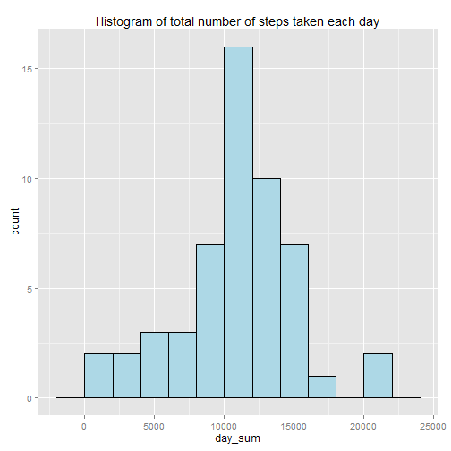
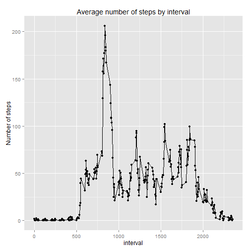
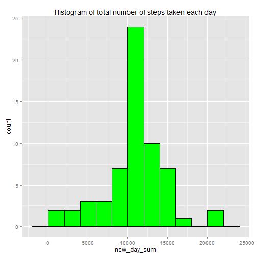
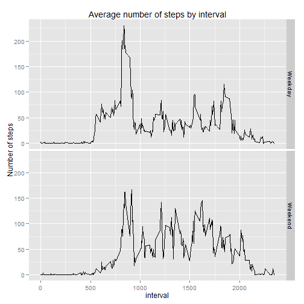

<br />

##Introduction

It is now possible to collect a large amount of data about personal movement using activity monitoring devices such as a Fitbit, Nike Fuelband, or Jawbone Up. These type of devices are part of the "quantified self" movement - a group of enthusiasts who take measurements about themselves regularly to improve their health, to find patterns in their behavior, or because they are tech geeks. But these data remain under-utilized both because the raw data are hard to obtain and there is a lack of statistical methods and software for processing and interpreting the data.

This assignment makes use of data from a personal activity monitoring device. This device collects data at 5 minute intervals through out the day. The data consists of two months of data from an anonymous individual collected during the months of October and November, 2012 and include the number of steps taken in 5 minute intervals each day.
<br />

Follows bellow the steps used to do suck analysis


<br />

## Loading and preprocessing the data

This steps loads the R libraries that wi'll be used on the analysis and the data from a .csv file that is presumed to be on the working directory


```r
library(ggplot2)
library(plyr)
library(dplyr)

data<-read.csv("activity.csv")
data$date <- as.Date(data$date)

summarydate <- ddply(data, 'date', summarise, day_sum = sum(steps), day_mean = mean(steps), day_median = median(steps))
summarydate_no_nas <- summarydate[-which(is.na(summarydate$day_sum)),]
```

<br />
<br />

## What is mean total number of steps taken per day?

For this part of the analysis, we are ignoring missing values in the dataset.

Follows a histogram of the total number of steps taken each day


```r
ggplot(summarydate_no_nas, aes(x=day_sum)) + geom_histogram(binwidth=2000, colour="black", fill="light blue") + ggtitle("Histogram of total number of steps taken each day")
```

 

<br />
Bellow we can see the mean and median total number of steps taken per day

```r
summarydate_no_nas[,c("date","day_mean","day_median")]
```

```
##          date day_mean day_median
## 2  2012-10-02   0.4375          0
## 3  2012-10-03  39.4167          0
## 4  2012-10-04  42.0694          0
## 5  2012-10-05  46.1597          0
## 6  2012-10-06  53.5417          0
## 7  2012-10-07  38.2465          0
## 9  2012-10-09  44.4826          0
## 10 2012-10-10  34.3750          0
## 11 2012-10-11  35.7778          0
## 12 2012-10-12  60.3542          0
## 13 2012-10-13  43.1458          0
## 14 2012-10-14  52.4236          0
## 15 2012-10-15  35.2049          0
## 16 2012-10-16  52.3750          0
## 17 2012-10-17  46.7083          0
## 18 2012-10-18  34.9167          0
## 19 2012-10-19  41.0729          0
## 20 2012-10-20  36.0938          0
## 21 2012-10-21  30.6285          0
## 22 2012-10-22  46.7361          0
## 23 2012-10-23  30.9653          0
## 24 2012-10-24  29.0104          0
## 25 2012-10-25   8.6528          0
## 26 2012-10-26  23.5347          0
## 27 2012-10-27  35.1354          0
## 28 2012-10-28  39.7847          0
## 29 2012-10-29  17.4236          0
## 30 2012-10-30  34.0938          0
## 31 2012-10-31  53.5208          0
## 33 2012-11-02  36.8056          0
## 34 2012-11-03  36.7049          0
## 36 2012-11-05  36.2465          0
## 37 2012-11-06  28.9375          0
## 38 2012-11-07  44.7326          0
## 39 2012-11-08  11.1771          0
## 42 2012-11-11  43.7778          0
## 43 2012-11-12  37.3785          0
## 44 2012-11-13  25.4722          0
## 46 2012-11-15   0.1424          0
## 47 2012-11-16  18.8924          0
## 48 2012-11-17  49.7882          0
## 49 2012-11-18  52.4653          0
## 50 2012-11-19  30.6979          0
## 51 2012-11-20  15.5278          0
## 52 2012-11-21  44.3993          0
## 53 2012-11-22  70.9271          0
## 54 2012-11-23  73.5903          0
## 55 2012-11-24  50.2708          0
## 56 2012-11-25  41.0903          0
## 57 2012-11-26  38.7569          0
## 58 2012-11-27  47.3819          0
## 59 2012-11-28  35.3576          0
## 60 2012-11-29  24.4688          0
```

<br />
<br />

##What is the average daily activity pattern?

1) Follows a time series report containing the average number of steps taken (on a 5-minute interval) across all days 

```r
byinterval <- ddply(data, 'interval',summarise, steps_avg = mean(steps, na.rm = TRUE))
ggplot(data=byinterval, aes(x=interval, y=steps_avg)) + geom_line() + geom_point() + ggtitle("Average number of steps by interval") + ylab("Number of steps")
```

 
<br />

2) Which 5-minute interval, on average across all the days in the dataset, contains the maximum number of steps?
<br />
By arranging the dataset used to build the graph above by average descending, we can get the first value, whihc represents the interval thta contains the maximum number of steps.


```r
arrange(byinterval, desc(steps_avg) )[1,"interval"]
```

```
## [1] 835
```

<br />
<br />

## Imputing missing values


The data set we are working with contaisa number of days/intervals where there are missing values. The presence of missing days may introduce bias into some calculations or summaries of the data.

<br /> 
1) Calculate and report the total number of missing values in the dataset 


```r
length(data$steps[data$steps =="NA"])
```

```
## [1] 2304
```

<br /> 
2) Devise a strategy for filling in all of the missing values in the dataset. 

  The chosen strategy was to use the mean for a particular 5-minute interval across all the dataset to set the missing values for that particular dataset.
  

```r
##In order to do that, I separeted the dataset where we have data
data_no_nas <- data[-which(is.na(data$steps)),]

##from the one we don't have data
data_nas <-    data[ which(is.na(data$steps)),]

##Then, I merged the "missing data" dataset with the dataset previously used that contains the average steps  by interval
mergeddata<-merge(data_nas, byinterval, by.x="interval", by.y="interval")
mergeddata$steps <- mergeddata$steps_avg
mergeddata <- subset(mergeddata, select = -c(steps_avg))

##at last, I added the dataset we just merged (thus containing new values) to the data set separated on the fist step ( the original values and the dataframe with the merged values)which we dont have to manipulate because it has all the values)
newdata <- rbind(data_no_nas, mergeddata)
```

<br /> 
3) Here is a second histagram on the steps taken each day, now with the estimated missing values. 


```r
summary_newdate <- ddply(newdata, 'date', summarise, new_day_sum = sum(steps), new_day_mean = mean(steps), new_day_median = median(steps))
ggplot(summary_newdate, aes(x=new_day_sum)) + geom_histogram(binwidth=2000, colour="black", fill="green") + ggtitle("Histogram of total number of steps taken each day")
```

 

<br /> 
We can see a small variation from the previous histagram duw to the "fixed values", which we can see a list here:

<br /> 

```r
compare <- merge(summarydate, summary_newdate, by.x="date", by.y="date")
compare <- tbl_df(compare)

filter(compare, is.na(day_sum) )
```

```
## Source: local data frame [8 x 7]
## 
##         date day_sum day_mean day_median new_day_sum new_day_mean
## 1 2012-10-01      NA       NA         NA       10766        37.38
## 2 2012-10-08      NA       NA         NA       10766        37.38
## 3 2012-11-01      NA       NA         NA       10766        37.38
## 4 2012-11-04      NA       NA         NA       10766        37.38
## 5 2012-11-09      NA       NA         NA       10766        37.38
## 6 2012-11-10      NA       NA         NA       10766        37.38
## 7 2012-11-14      NA       NA         NA       10766        37.38
## 8 2012-11-30      NA       NA         NA       10766        37.38
## Variables not shown: new_day_median (dbl)
```

<br />
Considering that the NAs are at a "day" level, meaning that a whole day is either all NA or doesn't have any NAs, the impact of the data fix was only on those days were those who had all NAs, the change didn't affect the days were we had data for.


<br />
<br />

##Are there differences in activity patterns between weekdays and weekends?

In order to analyse that, a new factor variable called isweekend was created. It contains levels - "weekday" and "weekend" indicating whether a given date is a weekday or weekend day.

<br />
Bellow is a plot containing a time seriesof the 5-minute interval and the average number of steps taken, averaged across all weekday days or weekend days:


```r
newdata$isweekday <- ifelse( (weekdays(newdata$date) %in% c('Saturday','Sunday')), 'Weekend', 'Weekday' )

newdatagroup <- ddply(newdata, c('interval','isweekday'),summarise, steps_avg = mean(steps, na.rm = TRUE))
ggplot(data=newdatagroup, aes(x=interval, y=steps_avg)) + geom_line() + ggtitle("Average number of steps by interval") + ylab("Number of steps") + facet_grid(isweekday ~ .)
```

 


