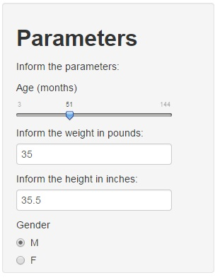

Developing Data Products Presentation
========================================================
author: Diego Menin
date: Wed Jan 14 16:35:20 2015
width: 1200
height: 900


Children BMI Analysis
========================================================

* Disclosure:

This presentation is part of the Developing Data Products course on the Data Science Specialization of the Johns Hopkins University of Public Health.
<br>
<br>
Please do not take any information found here or on the related Shiny application seriously, the main output of this exercise are the data products themselves, not the information provided


Children BMI Analysis
========================================================

Dear Parent,

Have you ever wondered if your child is over or under weight compared to other children his\her age?
<br>
<br>
If you are a good parent (and I'm sure you are), we have the right application for you to answer that question. 


How does it work?
========================================================

Using reliable data from the  National Health and Nutrition Examination Survey (NHANES)* and very advanced data aggregations, we are able to analyse how far your child is from the average BMI from children his\her age
<br>
<br>
Here's an example of our data:


```
   age weight height gender
1   58     38     38      M
2  103     87     43      M
3   87     50     48      M
4  138     98     61      M
5   82     47     47      F
6   52     30     24      F
7   28     24     29      M
8   79     45     48      F
9  107    144     59      M
10  45     24     24      M
```

*The NHANES  is a program of studies designed to assess the health and nutritional status of adults and children in the United States

How do I do it?
========================================================

All you have to do is inform your kid's gender, age, height and weight:



and the system will calculate your kid's BMI related to the average.
A plot with other kids information will be displayed so you can have an idea were your child is located in comprisson to others.


Please click [Here](https://dmenin.shinyapps.io/CourseraDataProductsProject/) to go to the website and give it a try.


