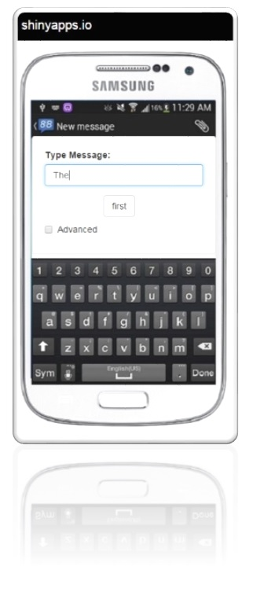
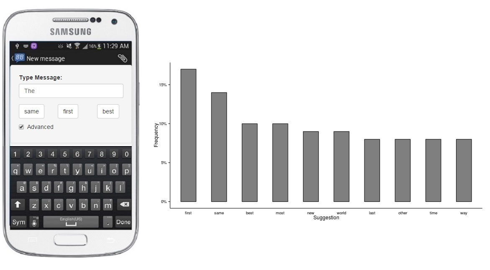

Data Science Specialization Capstone Project
========================================================
author: Diego Menin
date: 21/04/2015

Developing a Natural Language Processing Model on Word Prediction
 
Coursera and SwiftKey Partnership

Goals
========================================================
- Build a predictive model of english text using Natural Language Processing Model and Text mining;
- Build a shiny App that uses the model to predict the next word on a sentence;

The Data and the Model
========================================================

- The data used to build the model was provided by Coursera and consits of sentences extracted from Twitter, News feeds and blogs;

- The model was buit using n-grams (1, 2, 3 and 4), which were stored using [Markov chains](http://en.wikipedia.org/wiki/Markov_chain);

- A sentence is predicted by looking up it's last N words on the chain (recursively on the 4 gram, 3 gram and so on...) and the match with the highest frequency is returned;

- A match with small frequency on a higher gram has more weight than a match with high frequency on a smaller gram.

The Application
====================================
left: 30%

***
<small style="font-size:.8em">
- The app is composed only by one input were you type your text;
- This project is being developed in partnership with Swiftkey, which develops text prediction apps for cellphones - thus the cellphone backgroud picture;
- The predicted word will be outputed on a button right under the text imput - this is to simulte the same behaviour we see on a cellphone;
- The button where the predicted word is returned is for display pourpouses only (nothing is meant to happen if you click it);
- [Link to the App](https://dmenin.shinyapps.io/TextPredicitonApp/);
</small>

Important Considerations
========================================================
<small style="font-size:.8em">

- If you are one of my colleages from Coursera evaluation the App and it is unavailable, please email me at dmenin@gmail.com - My Shiny App account is close to the free usage limit and has actually been locked once so I'm afraid it can happen again during evaluation time;
- There is a checkbox called "advanced" which , uppon clicked, will output the TOP 3 predictions plus a graph with the grams and frequency.
</small>

